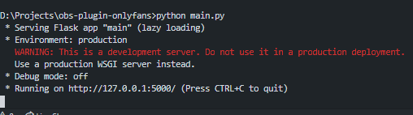
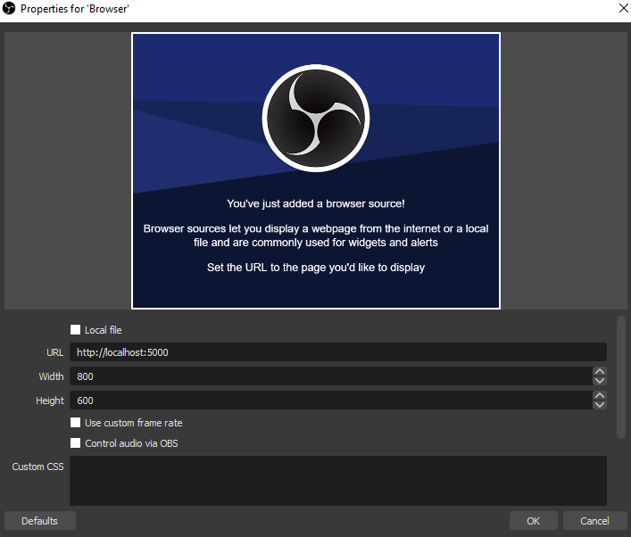

# obs-plugin-onlyfans

OBS Plugin that shows your last onlyfans subscriber. Created with python and react.

## Requirements

### Python

- Only python 3 is supported

### Python libraries

- requests
- flask
- and few other that come preinstalled with python

## Installation

### Downloading and installing requirements

1. Download and unpack the bot from [here](https://github.com/xnetcat/obs-plugin-onlyfans/archive/master.zip) or git clone the repo
2. pip install -r requirements.txt

## Configuration

### Auth

We need cookies to authorize the requests, so head to onlyfans, login and open the network debugger, search for `init?app-token` or something along these lines. And find `auth_id`, `sess`, `user-agent` and `app-token`. Save these values to a file called `auth.json` like.

Here is how it should look:

```json
{
  "auth_id": "43534543",
  "sess": "dsbsadbf4bb44543b534b534b543",
  "app_token": "b546b5n54n45b645b64555n63",
  "user_agent": "Mozilla/5.0 (Windows NT 10.0; Win64; x64) AppleWebKit/537.36 (KHTML, like Gecko) Chrome/88.0.4324.104 Safari/537.36",
}
```

Or use [this](https://github.com/M-rcus/OnlyFans-Cookie-Helper) extension and copy-paste the results to file

### Ignore

We will also need a file that will store information about known subscribers. To do so just create a file called `ignore.json` and copy paste the text from below

```json
{"ignore": []}
```

### Running app

To start the plugin just execute `python main.py` or double click the downloaded file

## OBS Configuration

To initialize plugin in obs just add browser source and point to the server in my case it is `http://localhost:5000`




## LICENSE

[MIT License](./LICENSE)
